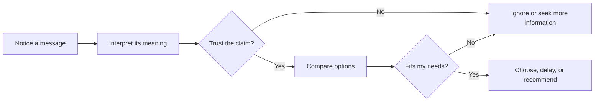

# Chapter 1: Persuasion and Human Decision-Making

Persuasion is part of ordinary life. A friend recommends a movie, a professor explains why an idea matters, and a package makes one product look more trustworthy than another. Designers and communicators work with these same forces deliberately.

## What Is Persuasion?

Persuasion is the process of shaping someone's attention, interpretation, trust, or action through communication and experience. It can involve words, images, layout, timing, evidence, social context, or the design of a choice.

Persuasion does not guarantee a particular result. It gives people reasons or cues to consider, while leaving room for judgment and refusal. Good persuasion helps a person understand an option well enough to decide whether it fits their needs.

### Persuasion, Manipulation, and Coercion

These terms are related, but they are not interchangeable:

- **Persuasion** presents reasons, evidence, or meaningful cues and respects the audience's ability to choose.
- **Manipulation** steers a person by hiding important information, exploiting a vulnerability, or creating a misleading impression.
- **Coercion** uses threats, punishment, or force so that refusing becomes unsafe or practically impossible.

The same design technique can be ethical or unethical depending on how it is used. Making a return policy easy to find can build trust. Hiding that policy behind confusing buttons can push people toward a choice they might reject if they had the full picture. The ethical test is not simply whether a design changes behavior. It is whether the influence is honest, proportionate, and compatible with the audience's interests.

## A Simple Decision Journey

People do not move directly from seeing a message to taking action. They notice some things, interpret them, form a level of trust, compare the option with alternatives, and then decide.

This journey is not perfectly linear. A new fact can change interpretation, and a disappointing experience can reduce trust after a purchase. A responsible designer makes the path clearer rather than trying to remove every moment of reflection.

## Cialdini's Principles of Influence

Robert Cialdini identified several recurring principles that help explain why people say yes. These principles describe tendencies, not laws. Context, culture, personal experience, and the quality of the offer still matter.

1. **Reciprocity:** People often feel inclined to return a useful favor. A helpful product guide can create goodwill, but a "free" sample should not be used to conceal unwanted obligations.
2. **Commitment and consistency:** After making a choice or stating a position, people often prefer actions that feel consistent with it. A progress checklist can support a goal; quietly turning a small click into a large commitment can exploit this tendency.
3. **Social proof:** When uncertain, people look to what similar or respected others are doing. Honest reviews and clearly labeled user numbers can reduce uncertainty; fake reviews and invented popularity are deceptive.
4. **Liking:** People are more open to people, products, and messages they find appealing or familiar. Warm, relevant communication can create connection; manufactured intimacy or flattery can disguise a weak offer.
5. **Authority:** Expertise and credible evidence can make a claim more persuasive. Showing a qualified reviewer helps people evaluate information; using a famous person who lacks relevant expertise can create false confidence.
6. **Scarcity:** Limited availability or time can increase perceived value and motivate action. A genuinely limited production run may be described accurately; false countdowns and permanently "selling out soon" messages create pressure without truth.
7. **Unity:** People can respond strongly to messages that connect an offer to a shared identity or community. Inclusive community language can help people recognize belonging; exclusionary identity claims can pressure people to prove that they belong.

## Two More Ideas for Designers

### Framing

Framing is the way a choice or fact is presented. The underlying option may stay the same while its perceived meaning changes. A white T-shirt described as "built for everyday layering" invites a practical interpretation. The same shirt described as "a blank canvas for your next idea" invites a creative one.

Framing is not automatically dishonest. Every message selects a point of view. It becomes misleading when the frame hides information that would reasonably change the decision, such as poor durability, extra costs, or an important limitation.

### Choice Architecture and Defaults

Choice architecture is the design of the environment in which people choose. The order of options, labels, defaults, reminders, and amount of information can all affect behavior. A checkout can make the sustainable shipping option easy to understand and easy to select.

Defaults deserve special care because many people accept the preselected option. A default is more defensible when it is easy to change, clearly explained, and aligned with the person's likely interests. Preselecting an unwanted subscription or making cancellation difficult is a dark pattern, not helpful guidance.

### The Elaboration Likelihood Model

The elaboration likelihood model describes two broad ways people process a message. With **central processing**, people pay attention to evidence and think carefully about the claim. With **peripheral processing**, they rely more on cues such as familiarity, visual appeal, confidence, or social proof.

Neither mode is automatically bad. A clear label may help someone make a quick low-stakes choice, while a medical or financial decision deserves accessible evidence and time for careful thought. The higher the stakes, the more a designer should support central processing instead of relying mainly on attractive cues.

## Principles, Uses, and Risks

| Principle or idea | Mechanism | Ethical use | Misuse risk |
| --- | --- | --- | --- |
| Reciprocity | A useful exchange can create goodwill and a desire to respond | Offer genuinely useful information before asking for attention or money | A "gift" creates hidden obligation or unwanted contact |
| Commitment and consistency | People prefer actions that fit earlier choices or statements | Let people set and review their own goals | A small commitment is used to trap someone in a larger one |
| Social proof | Other people's behavior helps resolve uncertainty | Show real, relevant, and representative reviews | Fake reviews, inflated numbers, or misleading testimonials |
| Liking | Familiarity and positive feelings increase openness | Use a human, respectful voice that fits the audience | Flattery or manufactured closeness hides weaknesses |
| Authority | Relevant expertise makes information easier to trust | Identify qualified sources and explain their relevance | Status or celebrity substitutes for evidence |
| Scarcity | Limited access can increase urgency and perceived value | State real limits such as a genuine production quantity | False countdowns or artificial shortage pressure |
| Unity | Shared identity can create belonging and motivation | Welcome people into a real community without gatekeeping | Identity pressure or exclusion is used to force agreement |
| Framing | Presentation changes what people notice and how they interpret it | Emphasize a true benefit that matters to the audience | Important drawbacks are omitted or disguised |
| Defaults | Preselected paths require less effort and often win | Choose a reversible default that serves the person's interest | Opt-outs are hidden or cancellation is intentionally difficult |

## The White T-Shirt: Same Product, Different Meaning

Imagine one plain white T-shirt made from the same material and sold at the same price. Its physical properties have not changed, but its presentation can change the decision around it:

- A product page emphasizing a precise fit, fabric weight, and care instructions frames it as a dependable wardrobe basic.
- A photograph of friends wearing it at a community event uses liking and unity to frame it as a shared symbol.
- A limited, truthfully numbered release uses scarcity to frame it as a collectible.
- A short guide showing five ways to layer it gives useful information first and frames it as a practical tool.

These frames can be legitimate if the claims are accurate and the shirt actually meets the expectations they create. The designer's responsibility is to make the meaning clearer, not to make the product seem like something it is not.

## Ethical Cautions

Before using a persuasive technique, consider the audience's situation. Children, people under financial pressure, and people making high-stakes health or safety decisions may be especially vulnerable to pressure. A technique that is acceptable for choosing a snack may be inappropriate for choosing a loan.

A useful standard is informed agency: people should have enough relevant information to understand the choice, enough freedom to decline, and a realistic opportunity to change their mind. Test persuasive designs for comprehension, not only conversion. Ask whether a person would still feel respected after discovering how the design influenced them.

## Questions to Ask Before Trying to Persuade

1. What decision am I asking someone to make, and why does it matter?
2. Who benefits if the person says yes? Who bears the cost or risk?
3. What information would a reasonable person want before deciding?
4. Am I using a real benefit, or exploiting fear, confusion, insecurity, or time pressure?
5. Can the person say no, pause, compare alternatives, and change their mind?
6. Are my examples, numbers, reviews, experts, and limits accurate and relevant?
7. Would I be comfortable explaining this design openly to the audience?
8. How will I learn whether the design helped people make a good decision rather than merely producing a quick action?

## Explore Further

For additional research, search for:

- Robert Cialdini's principles of influence and their ethical applications
- framing effects in psychology and behavioral economics
- choice architecture and dark patterns
- the elaboration likelihood model in communication
- informed consent and ethical design

## What You Should Remember

Persuasion shapes attention, interpretation, trust, and action, but it should not take away a person's agency. Cialdini's principles, framing, choice architecture, and processing style help explain why messages work. The same white T-shirt can acquire different meanings through presentation, yet ethical design keeps the claims truthful, the choice understandable, and the decision genuinely open.
