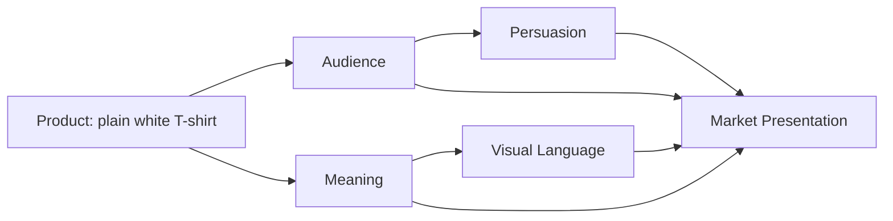

# The Plain White T-Shirt Case Study

A plain white T-shirt is one of the most ordinary products in the world. It is easy to overlook. But that is exactly why it is such a useful case study. A shirt can be marketed as a symbol of freedom, authority, craft, rebellion, comfort, or belonging. The physical product stays mostly the same, while the meaning changes dramatically.

This chapter takes one ordinary high-quality plain white T-shirt and presents it in four radically different ways. Each version uses the same shirt, but changes the story, audience, persuasion, and visual language. The point is to show how a product becomes a market presentation when meaning is built around audience desire, archetype, and design language.

## The Product

The product is a premium, well-made, plain white T-shirt. It has a good fit, quality cotton, durable stitching, and a clean silhouette. Nothing about it is flashy on its own. That is the challenge: how do you turn an ordinary garment into a clear identity signal?

The answer is not to change the shirt. It is to change the story.

## Concept 1: Explorer — The Shirt for the Open Road

### Audience

Young adults, travelers, weekend hikers, digital nomads, and people who want a clothes label that feels adventurous without being loud.

### Brand archetype

Explorer

### Persuasion principles

- aspiration: the customer is invited to imagine themselves as capable and free
- social proof through lifestyle imagery: the shirt is seen in motion, outdoors, and on the go
- simplicity: the product is presented as honest and functional, not cluttered or pretentious

### Visual-design language

Natural, adventurous, tactile, and grounded. Warm earth tones, photography of landscapes, textured backgrounds, practical typography, and open space.

### Headline

"Wear the Day You Want to Have."

### Short product story

This shirt is built for movement. It is the kind of garment you throw on before a train ride, a mountain walk, or an unplanned detour. It is made to be comfortable enough for real life and simple enough to feel like a second skin.

### Likely imagery

A person standing by a road, by a lake, on a train platform, or hiking at sunrise. The shirt appears clean, durable, and ready for practical adventure.

### What meaning the customer is buying

The customer is not buying a shirt alone. They are buying the feeling of agency, freedom, and readiness. They are buying a version of themselves that is mobile, curious, and not tied to one place.

### Ethical concern or possible misuse

This approach can romanticize travel and adventure while ignoring access, class, and comfort. It may also suggest that a shirt can transform a person into a traveler, even when the person is simply wearing it in a city.

## Concept 2: Ruler — The Shirt as Discipline and Quality

### Audience

Professionals, creators, graduates, designers, and consumers who value polish, structure, and credibility.

### Brand archetype

Ruler

### Persuasion principles

- authority: the shirt signals competence and self-command
- trust: quality materials and careful design imply reliability
- clarity: the product is presented as orderly, controlled, and premium

### Visual-design language

Restrained modernist / Swiss-influenced. Clear grid, ample white space, precise typography, symmetric or carefully asymmetrical alignment, minimal colors, and disciplined framing.

### Headline

"A Better Standard."

### Short product story

This shirt is designed not to shout. It is made to be the kind of item a person reaches for when they want to look considered, capable, and deliberate. The shirt is quiet because quality should not need to perform.

### Likely imagery

Studio photography, neutral backdrop, measured composition, sharp focus, fabric close-ups, label details, and a clear, professional layout.

### What meaning the customer is buying

They are buying control, standards, and social confidence. The shirt communicates that they know what is well-made and they prefer quality over noise.

### Ethical concern or possible misuse

The presentation can easily slip into status signaling. The shirt becomes a badge of refinement rather than a garment for everyday use. That can exclude consumers who do not align with the visual language of authority or premium taste.

## Concept 3: Rebel — The Shirt as Refusal to Blend In

### Audience

Artists, students, stylists, nightlife audiences, and younger shoppers who want their clothing to communicate independence and edge.

### Brand archetype

Rebel

### Persuasion principles

- differentiation: the shirt stands out by rejecting the norm
- identity signaling: the customer wants to feel distinct and self-determined
- disruption: the design breaks expectations to create attention

### Visual-design language

Disruptive or postmodern. Broken grids, oversized type, asymmetrical cropping, collage-like layering, hard contrasts, expressive typography, and a deliberately uncomfortable sense of rhythm.

### Headline

"Not Basic."

### Short product story

This is not a shirt for people who want to disappear into a crowd. It is for those who want to look intentional, rough around the edges, and just a little renegade. The shirt is still simple, but the presentation turns simplicity into a statement of attitude.

### Likely imagery

High-contrast photos, layered textures, angular framing, harsh shadows, sliced compositions, and type that feels almost aggressive or intentionally off-balance.

### What meaning the customer is buying

They are buying autonomy and nonconformity. The shirt becomes a way to say: "I am not trying to fit into your system."

### Ethical concern or possible misuse

The danger is performative rebellion. A brand can use disruption as a shortcut to authenticity without actually offering anything meaningful. It may also reduce a real political or cultural challenge into a style choice.

## Concept 4: Caregiver — The Shirt as Everyday Ease and Trust

### Audience

Parents, students, remote workers, and consumers who prioritize comfort, reliability, and low-stress everyday life.

### Brand archetype

Caregiver

### Persuasion principles

- reassurance: the shirt promises comfort and trust
- practicality: the customer wants a garment that works without friction
- emotional safety: the design reduces decision fatigue and makes daily life easier

### Visual-design language

Warm, soft, approachable, and plainspoken. Rounded typography, natural colors, simple textures, and images of everyday routines rather than spectacle.

### Headline

"The Shirt You Can Count On."

### Short product story

This shirt is the dependable one in the closet. It feels easy, fits well, and does not ask for too much attention. It is the garment you reach for when the day is already full and you need one less thing to worry about.

### Likely imagery

Morning coffee, home life, desk work, soft light, casual domestic scenes, and close-ups of fabric texture and ease of movement.

### What meaning the customer is buying

They are buying relief: a quiet, trustworthy product that makes everyday life feel smoother. The shirt says, "You do not need to perform. You can just be comfortable."

### Ethical concern or possible misuse

This approach can become manipulative if it pretends the product is morally superior simply because it is practical or comforting. A brand can use sincerity as a way to hide a weak product or an inflated price.

## Synthesis Table

| Concept | Target audience | Archetype | Persuasion principles | Visual language | Headline | Core meaning sold |
| --- | --- | --- | --- | --- | --- | --- |
| Explorer | Travelers, young professionals, outdoor-oriented buyers | Explorer | aspiration, mobility, simplicity | natural, tactile, lifestyle photography | "Wear the Day You Want to Have." | freedom and readiness |
| Ruler | Professionals, polished consumers, design-minded buyers | Ruler | authority, trust, clarity | restrained modernist / Swiss-influenced | "A Better Standard." | competence and quality |
| Rebel | Artists, students, trend-conscious consumers | Rebel | differentiation, disruption, identity | postmodern, collage-like, expressive | "Not Basic." | autonomy and nonconformity |
| Caregiver | Everyday households, students, remote workers | Caregiver | reassurance, practicality, emotional ease | warm, soft, unpretentious | "The Shirt You Can Count On." | comfort and trust |

## How the Product + Audience + Meaning + Persuasion + Visual Language Combine

The diagram matters because it shows that the shirt alone is not the message. The market presentation is created by the combination of audience, persuasion, meaning, and visual language. A designer or brand strategist does not simply choose a garment; they choose a narrative and a visual system for how that garment will be recognized in the world.

## Why This Matters

The same physical product can be marketed in several different ways because meaning is not naturally attached to the object. Meaning is constructed. It is built with design choices, messaging, audience assumptions, and emotional cues. The shirt is not the story. The story is what makes the shirt valuable.

This is why a good brand strategy matters. It clarifies what the product is for, who it is for, and what kind of person the customer is invited to become.

## What You Should Remember

- A plain white T-shirt can carry many identities because the meaning is constructed around it.
- Archetype helps decide the emotional role the product will play.
- Persuasion works best when it fits the audience's actual desires and anxieties.
- Visual language shapes whether the product feels disciplined, adventurous, rebellious, or reassuring.
- The same product can be sold as freedom, authority, nonconformity, or comfort.
- Ethical marketing means being honest about what the product is really promising and not pretending identity can be purchased as a shortcut.

In other words: the shirt is the object, but the brand creates the story that makes the object feel like a life choice.
