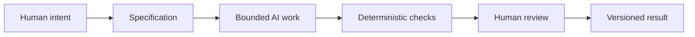

# Synthesis: Persuasion, Archetype, Design Language, and AI

The earlier chapters each focused on one lens: persuasion explains how a message can move an audience, archetypes explain how meaning and identity are attached to a product or organization, and design language explains how visual choices communicate values. Taken together, they form a practical framework for directing creative and technical work, including work that uses AI.

This final chapter connects those lenses into a simple system for thinking about intent, communication, and control.

## Three Lenses, One Decision

A strong creative or technical project usually needs to answer three questions:

- Persuasion: What response are we trying to enable?
- Archetype: What meaning or identity are we expressing?
- Design language: How should that meaning look and feel?

These questions are related, but they are not identical. Persuasion asks about action and response. Archetype asks about identity and emotional meaning. Design language asks about the visible form of the message. Together, they help define the work before the work is made.

For example, imagine a marketing page for a simple shirt. The persuasion goal may be to encourage a customer to buy and feel confident. The archetype may be Explorer, Ruler, or Rebel. The design language may be modernist and restrained, or postmodern and disruptive. The output changes because the intent changes. This is why it is useful to define the problem in terms of the audience, meaning, and expression before asking AI to generate text, design directions, or code.

## Why a Specification Matters

AI is powerful, but it becomes much more useful when the task is bounded. A vague request like "make this look good" or "write something persuasive" leaves too much open. The model may produce something plausible but directionless. A specification gives the system constraints: audience, objective, tone, length, format, allowed style, and success criteria.

A good specification is not a cage. It is a frame. It reduces drift and helps maintain focus. It clarifies what good looks like. Without a specification, AI can generate a lot of output that is polished but not aligned with the actual task.

A strong specification usually explains:

- the purpose of the work
- the target audience
- the desired emotional tone
- the required format or structure
- constraints on style, claims, and evidence
- what counts as success

This is how AI work becomes manageable. It starts as intent, then moves into boundaries, then into execution.

## The Role of Deterministic Checks

Not all validation is equally expensive or equally reliable. Some checks are cheap, repeatable, and objective. These are deterministic checks.

Examples include:

- checking whether a file exists
- verifying a required heading is present
- confirming a Markdown table has the expected columns
- running linting or tests
- checking that a required section name appears exactly
- verifying a diagram is syntactically valid

Deterministic checks are valuable because they can run quickly and consistently. They do not decide whether the work is meaningful, but they can catch obvious errors early. A lot of AI-generated work can be improved by using cheap validation first. This reduces wasted review time and makes iteration more efficient.

## Why AI Review Is Useful but Probabilistic

AI review can be useful for second-pass analysis. It can help look for missing requirements, unclear phrasing, weak structure, or contradictions. It can also surface alternative formulations or identify gaps in the reasoning.

However, AI review is probabilistic. It is not the same as verification. It may sound confident while missing a real issue. It may be helpful with style and structure, but it may also hallucinate, flatten nuance, or produce smooth statements that are not actually true. AI review is best used as a support tool, not as the final authority.

This is where the race-car pit-stop metaphor is useful. In a race, the car keeps moving, but selected moments deserve deliberate human inspection: tires, fuel, decisions, and safety checks. The same is true with AI-assisted work. Automation can keep running, but the human team must pause at the critical moments where judgment matters.

## Why Human Judgment Still Matters

Humans remain responsible for several things that AI does not fully own:

- meaning: what the work is actually trying to say
- truthfulness: whether claims are credible and evidence-backed
- context: whether the situation requires cultural, historical, or domain awareness
- ethics: whether the communication is manipulative, exclusionary, or misleading
- final decisions: whether the output is acceptable or should be revised

An AI model can generate options, but it cannot fully understand the social consequences of every decision. It cannot replace a human's sense of judgment, responsibility, and context. This is especially true for creative work, persuasion, and communication that affects belief, behavior, or trust.

## Why Version Control Matters

When AI is generating work, version control matters even more than usual. Git provides traceability. It records what changed, when it changed, and who made the change. That matters because AI output can be fast, iterative, and inconsistent. A student or team may need to recover an earlier version, compare divergent drafts, or isolate the exact change that introduced a problem.

Git makes it possible to:

- review changes across time
- revert to a prior version when needed
- compare different approaches without losing earlier work
- work collaboratively with a clear record of progress
- maintain a disciplined workflow in a project that is changing quickly

In other words, AI can accelerate creation, but version control protects the process from chaos. Without it, you risk losing the ability to explain or recover decisions.

## Diagram of the Workflow

This workflow is intentionally simple. Human intent begins the process. The specification defines the boundaries. AI work is then scoped and constrained. Deterministic checks catch obvious issues cheaply. Human review focuses on judgment, meaning, truthfulness, and context. The final result is a versioned outcome that can be revisited, compared, and improved.

## Using the Three Lenses to Direct AI

The three lenses help direct AI in a more disciplined way:

- Persuasion answers the purpose: What should the output try to accomplish?
- Archetype answers the identity: What emotional and cultural meaning are we expressing?
- Design language answers the form: How should that meaning be presented visually or structurally?

When these are defined clearly, an AI system can operate with much better intent. It is not guessing what the work is for. It is given directional clarity. That produces better drafts, more aligned revisions, and more defensible final work.

## Why This Matters for Creative and Technical Work

The same logic applies beyond marketing. It applies to writing, interface design, documentation, product messaging, reports, and technical explanations. In every case, the work needs a clear audience, a clear purpose, and a clear standard for quality.

A well-bounded AI workflow does not eliminate creativity. It creates conditions where creativity can be productive rather than chaotic. It reduces wasted effort. It makes review more meaningful. It keeps responsibility with the human team while letting automation handle the repetitive or preliminary parts of the task.

## Questions for Next Week

- How would you define a good specification for a small AI-assisted project?
- Which checks in your workflow could be deterministic rather than subjective?
- Where should human review happen, and why?
- How might archetype change the tone of the same content without changing the facts?
- What kinds of design-language choices affect credibility and trust?

## What You Should Remember

- Persuasion, archetype, and design language are complementary lenses for understanding communication.
- A specification is essential because AI works best when the task is bounded and intentional.
- Deterministic checks are useful because they are cheap, repeatable, and objective.
- AI review is helpful but probabilistic, so it should support human judgment rather than replace it.
- Git matters because it preserves traceability, recovery, and comparison across revisions.
- Human beings remain responsible for truth, context, meaning, ethics, and the final decision.
- The best AI-assisted workflow is not fully automated; it is a disciplined loop of intent, constraint, validation, and careful human review.

The goal is not to remove judgment from the process. The goal is to make judgment more useful by giving it better information, better constraints, and better tools.
